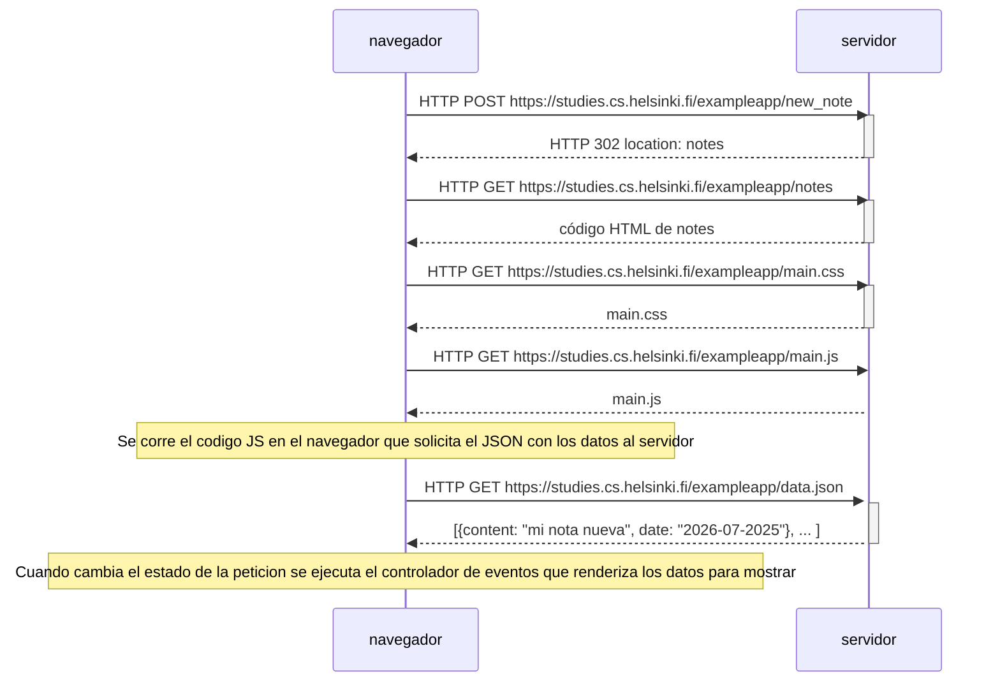

```mermaid
sequenceDiagram
    participant navegador
    participant servidor
    
    navegador->>servidor: HTTP POST https://studies.cs.helsinki.fi/exampleapp/new_note
    activate servidor
    servidor-->>navegador: HTTP 302 location: notes
    deactivate  servidor
    navegador->>servidor: HTTP GET https://studies.cs.helsinki.fi/exampleapp/notes
    activate servidor
    servidor-->>navegador: código HTML de notes
    deactivate servidor
    navegador->>servidor: HTTP GET https://studies.cs.helsinki.fi/exampleapp/main.css
    activate servidor
    servidor-->>navegador: main.css
    deactivate servidor
    navegador->>servidor: HTTP GET https://studies.cs.helsinki.fi/exampleapp/main.js
    activate servidor
    servidor-->>navegador: main.js
    Note over navegador: Se corre el codigo JS en el navegador que solicita el JSON con los datos al servidor

    navegador->>servidor: HTTP GET https://studies.cs.helsinki.fi/exampleapp/data.json
    activate servidor
    servidor-->>navegador: [{content: "mi nota nueva", date: "2026-07-2025"}, ... ]
    deactivate servidor
    Note over navegador: Cuando cambia el estado de la peticion se ejecuta el controlador de eventos que renderiza los datos para mostrar
```