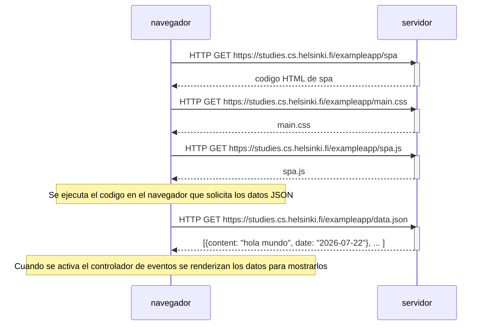

```mermaid
sequenceDiagram
    participant navegador
    participant servidor

    navegador->>servidor: HTTP GET https://studies.cs.helsinki.fi/exampleapp/spa
    activate servidor
    servidor-->>navegador: codigo HTML de spa
    deactivate servidor
    navegador->>servidor: HTTP GET https://studies.cs.helsinki.fi/exampleapp/main.css
    activate servidor
    servidor-->>navegador: main.css
    deactivate servidor
    navegador->>servidor: HTTP GET https://studies.cs.helsinki.fi/exampleapp/spa.js
    activate servidor
    servidor-->>navegador: spa.js
    deactivate servidor
    Note over navegador: Se ejecuta el codigo en el navegador que solicita los datos JSON
    navegador->>servidor: HTTP GET https://studies.cs.helsinki.fi/exampleapp/data.json
    activate servidor
    servidor-->>navegador: [{content: "hola mundo", date: "2026-07-22"}, ... ]
    deactivate servidor
    Note over navegador: Cuando se activa el controlador de eventos se renderizan los datos para mostrarlos
```