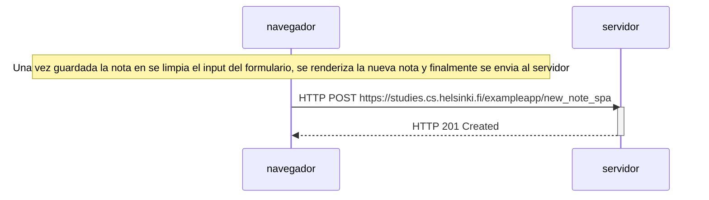

```mermaid
sequenceDiagram
    participant navegador
    participant servidor

    Note over navegador: Una vez guardada la nota en se limpia el input del formulario, se renderiza la nueva nota y finalmente se envia al servidor
    navegador->>servidor: HTTP POST https://studies.cs.helsinki.fi/exampleapp/new_note_spa
    activate servidor
    servidor-->>navegador: HTTP 201 Created
    deactivate servidor
```